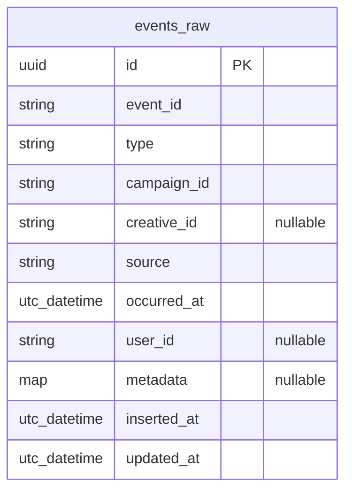

# Software Architecture + Refactoring Test (Elixir or TypeScript)

Thanks for applying to a Software Engineer position at Tupi.

This test also evaluates soft skills and technical skills that are important in our culture.

## Soft skills evaluation

1. Pro-activity
2. Communication
3. Self-taught mindset
4. Critical thinking
5. Self-management

## Technical skills evaluation

1. Debugging
2. Git versioning
3. Planning a solution
4. Architecture
5. Automated tests (and TDD mindset)
6. Generative AI usage (ChatGPT, Bing, Gemini, Codeium, etc.)

We know a take-home alone is not enough to evaluate everything, so interviews may include follow-up questions about your approach.

## Process rules

1. We value fast solutions and deadlines, so do not spend more than **4 hours** on this test.
2. Before starting the 4-hour window, take time to read instructions, research, and plan your approach.
3. Clone this repository locally (please do not fork it).
4. To start counting your 4-hour period, commit a blank `README.md` in the repository root at the beginning of your test.
5. Commit frequently (recommended every 25-30 minutes). Avoid one single large final commit.
6. We do not expect complete implementation. At the end of the 4-hour window, stop and submit your zipped local repository (including `.git`) to your hiring contact.
7. Reserve 30-60 minutes at the end to document your thinking, trade-offs, and usage instructions. Communication quality is part of the evaluation.
8. You can and should use AI support. Please mention which tools you used in your `README.md` and optionally share key prompts.
9. You can solve this challenge using either:
   - **Elixir/Phoenix** in `analytics/elixir_phoenix`
   - **TypeScript/NestJS** in `analytics/typescript_nestjs`
10. Keep automated tests runnable for your chosen stack (`mix test` for Elixir, `npm test` or `npm run test:e2e` for TypeScript).

## Implementation options

Choose one implementation track:

1. `analytics/elixir_phoenix` (Elixir/Phoenix)
2. `analytics/typescript_nestjs` (TypeScript/NestJS)

The domain, API contract, evaluation criteria, and constraints are the same for both tracks.

This take-home exercise is scoped for approximately **2–4 hours**.
LLM assistance is allowed and recommended, we expect you to explain how did you use it.
Evaluation focuses on correctness, judgment, and code quality.

## Real-world context

This kind of system is common in ad-tech and recommendation products, where clients send impression (view) and click events continuously.
The resulting data is used for reporting, pacing, billing, and optimization, so both high throughput and strict counting correctness are important.

## Context

The provided API implementations are functional but intentionally limited in architecture and performance.

## Objective

A revised solution is expected to preserve the API contract while improving:
- correctness under duplication and concurrency
- ingest-path performance
- stats-query efficiency
- architectural boundaries and maintainability
- test coverage for critical behavior

## Evaluation criteria

Priority is given to:
1. Correctness
2. Performance and scalability
3. Code quality and maintainability
4. Architectural clarity
5. Testing and communication

## Domain requirements

### Performance target
- The ingest path is expected to sustain **100,000 events per minute**.

### Event fields


### Rules
- `occurred_at` remains valid ISO8601 UTC.
- `type` remains constrained to known values.
- A repeated `event_id` is not counted twice.
- `/events` remains suitable for high-volume ingest.
- `/stats` is backed by pre-aggregated data, not large raw-event grouping.

## API contract (unchanged)

### `POST /events`
`Click` event example:
```json
{
  "event_id": "1f5a9d3c-0000-0000-0000-000000000000",
  "type": "click",
  "campaign_id": "camp_123",
  "creative_id": "cr_456",
  "source": "web",
  "occurred_at": "2026-02-10T21:10:00Z",
  "user_id": "u_999",
  "metadata": {"ip": "1.2.3.4"}
}
```

`Impression` event example:
```json
{
  "event_id": "2a7b8c9d-1111-2222-3333-444444444444",
  "type": "impression",
  "campaign_id": "camp_123",
  "creative_id": "cr_456",
  "source": "web",
  "occurred_at": "2026-02-10T21:12:00Z",
  "user_id": "u_1001",
  "metadata": {"placement": "feed_top"}
}
```
Responses:
- `202 Accepted` for accepted ingest
- `422 Unprocessable Entity` for invalid input
- duplicate handling may be either:
  - `202` with duplicate ignored, or
  - `409 Conflict`
  Consistency and test coverage are expected for the chosen behavior.

### `GET /stats?campaign_id=<id>&from=<iso>&to=<iso>&granularity=minute`
Example response:
```json
{
  "campaign_id": "camp_123",
  "from": "2026-02-10T21:10:00Z",
  "to": "2026-02-10T21:20:00Z",
  "granularity": "minute",
  "series": [
    {"ts":"2026-02-10T21:10:00Z","impressions":1200,"clicks":32},
    {"ts":"2026-02-10T21:11:00Z","impressions":1188,"clicks":29}
  ]
}
```
`series` is expected to be ordered by timestamp.

## Technical expectations

The architecture is expected to show clear boundaries (for example domain/application/ports/adapters), thin HTTP controllers, and explicit handling of dedupe/idempotency.

A storage design that supports efficient minute-level aggregation is expected. Any sound approach is acceptable when correctness and scalability are demonstrated.

Minimal domain-event publishing is also expected (for example accepted and duplicate-ignored outcomes), with boundaries expressed through interfaces/behaviours.

## Tests

Coverage is expected for at least:
1. valid ingest (`202`)
2. duplicate `event_id` behavior (single count effect)
3. stats correctness for known data
4. concurrency safety (parallel ingest without over-count)

## Setup

### Option A: Elixir/Phoenix (`analytics/elixir_phoenix`)

```bash
cd analytics/elixir_phoenix
mix deps.get
docker compose up -d
mix ecto.setup
mix test
mix phx.server
```

### Option B: TypeScript/NestJS (`analytics/typescript_nestjs`)

```bash
cd analytics/typescript_nestjs
npm install
docker compose up -d
npm run prisma:migrate
npm run test:e2e
npm run start:dev
```

## Deliverables

- Zip this repository with .git directory containing all your commits. Do not fork or open a PR for it.
- passing tests
- any migration updates
- `NOTES.md` describing:
  - chosen track (Elixir/Phoenix or TypeScript/NestJS)
  - ingestion strategy and rationale
  - dedupe/concurrency correctness approach
  - trade-offs and next steps
  - optional short note on LLM usage

## Constraints

- API contract remains unchanged.
- Eventual consistency for stats is acceptable.
- Avoided complexity is preferred unless justified by clear benefit.
